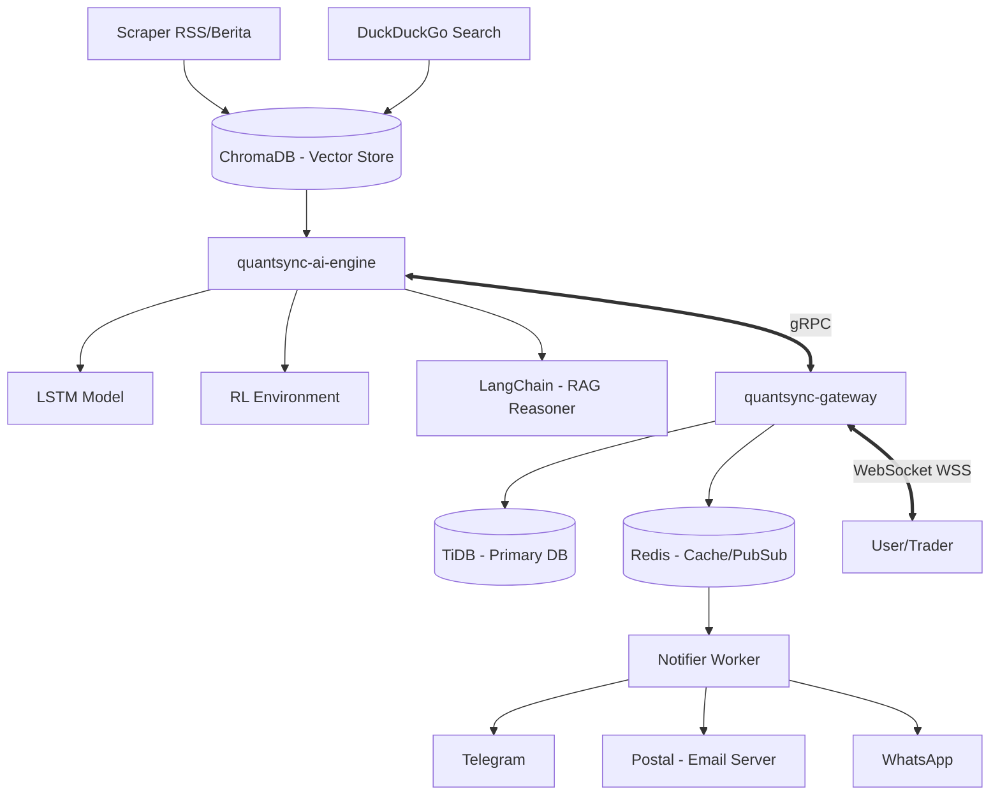

# QuantSync

**Arsitektur trading masa depan, hari ini.** QuantSync adalah fusi sempurna antara analitik deep learning dan eksekusi data latensi nol. Melalui pemantauan sentimen tanpa henti dan kalkulasi model matematis kompleks, kami mendistribusikan sinyal trading dengan metrik win-rate yang terukur, terstruktur, dan transparan.

## Arsitektur Sistem



## Fitur Utama
- **Deep Learning Core**: Prediksi harga menggunakan model LSTM (PyTorch) dengan deteksi hardware otomatis (CUDA/MPS/CPU).
- **RAG Reasoning**: Setiap sinyal dilengkapi dengan alasan yang dihasilkan oleh LangChain berbasis sentimen pasar terkini.
- **High Performance Gateway**: Backend Go dengan arsitektur hub-driven dan Rate Limiting berbasis Token Bucket (Redis).
- **Enterprise Security**: Autentikasi Ed25519 JWT dan manajemen konfigurasi terpusat (Tanpa file `.env`).
- **Self-Hosted Email**: Menggunakan Postal untuk pengiriman notifikasi email skala enterprise.

## Client Integration Guide

QuantSync tidak menyediakan REST API untuk distribusi sinyal guna menjaga latensi tetap nol. Seluruh data dikirimkan melalui **WebSocket (WSS)**.

### 1. Koneksi WebSocket
URL Endpoint: `wss://api.quantsync.com/ws?token=YOUR_JWT_TOKEN`

### 2. Autentikasi
Klien harus menyertakan JWT token yang valid yang ditandatangani menggunakan algoritma **Ed25519**. Token harus berisi klaim user ID dan Plan langganan.

### 3. Struktur JSON Sinyal
Saat sinyal baru dideteksi, server akan mengirimkan payload JSON berikut:

#### Crypto (Spot)
```json
{
  "id_signal": "uuid-v4-string",
  "no": 1,
  "asset": "BTC/USDT",
  "price": 52000.50,
  "action": "buy",
  "type_action": "market",
  "type_signal": "long",
  "tp1": 53500.00,
  "tp2": 55000.00,
  "sl1": 51000.00,
  "sl2": 50500.00,
  "probability_pct": 87.5,
  "winrate_pct": 74.2,
  "reason": "Analisis LSTM menunjukkan momentum bullish kuat, didukung oleh berita persetujuan ETF yang tersimpan di ChromaDB.",
  "timestamp": "2026-05-06T09:40:00Z"
}
```

#### Forex
```json
{
  "id_signal": "uuid-v4-string",
  "no": 1,
  "asset": "EUR/USD",
  "price": 1.0850,
  "action": "sell",
  "type_action": "limit",
  "type_signal": "short",
  "tp1": 1.0750,
  "tp2": 1.0700,
  "sl1": 1.0900,
  "sl2": 1.0950,
  "probability_pct": 82.1,
  "winrate_pct": 68.5,
  "reason": "Sentimen pasar cenderung bearish pasca rilis data inflasi. Model RL merekomendasikan entri sell.",
  "timestamp": "2026-05-06T09:40:00Z"
}
```

## Cara Menjalankan (Development)
```bash
docker-compose up --build
```
Pastikan port 8080 (Gateway) dan 4000 (TiDB) tersedia di sistem Anda.
